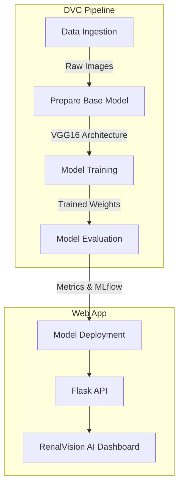

# 🏥 RenalVision AI: Kidney Disease Detection

[](https://mlflow.org/)
[](https://dvc.org/)
[](https://tensorflow.org/)
[](https://flask.palletsprojects.com/)

RenalVision AI is an end-to-end MLOps project focused on the early **detection and classification of kidney disease** (Normal vs. Tumor) using deep learning and CT scan imagery. This project integrates state-of-the-art data versioning, experiment tracking, and a premium modern UI.

---

## ⚡ Problem Statement
Kidney cancer is among the most common cancers globally, and early detection is critical for patient survival. Manual analysis of CT scans can be time-consuming and prone to human error. **RenalVision AI** aims to assist clinicians by providing a high-confidence neural network diagnosis, leveraging a fine-tuned VGG16 architecture to identify tumors with precision.

## 🛠️ Tech Stack
| Category | Technology |
| :--- | :--- |
| **Deep Learning** | TensorFlow, Keras, VGG16 |
| **MLOps & Data** | DVC (Data Version Control), MLflow (Experiment Tracking) |
| **Web Framework** | Flask, Vanilla CSS (Premium Glassmorphism Design) |
| **Containerization** | Docker |
| **Cloud** | GCP (Cloud Run, Artifact Registry) |
| **CI/CD** | GitHub Actions |

---

## 📐 Project Architecture
The project follows a modular, pipeline-driven architecture orchestrated by **DVC**:



---

## 🚀 Key Features

### 1. Modern Diagnostic UI
The project features a premium **Glassmorphism-styled dashboard** branded as "RenalVision AI." It includes:
- **Interactive Scanning**: Visual "laser line" animation during image analysis.
- **Visual Result Badges**: High-contrast diagnostic feedback (Normal vs. Tumor).
- **Responsive Theme**: A tech-forward, dark medical interface designed for high-end professional use.

### 2. MLOps Core (DVC & MLflow)
- **DVC Orchestration**: Automated reproducibility of all training stages.
- **Smart Caching**: Skip redundant stages (like data ingestion) when source data hasn't changed.
- **MLflow Integration**: Full experiment tracking of losses, accuracies, and hyperparameters, hosted remotely via DAGsHub.

### 3. Fine-tuned Deep Learning
Unlike basic classification apps, RenalVision AI uses **Fine-tuning**:
- **Architecture**: VGG16 base with custom Dense layers.
- **Optimization**: Unfreezes the last 4 convolutional layers to adapt specialized medical feature detection.

---

## 📂 Pipeline Stages (`dvc.yaml`)
1. **Data Ingestion**: Downloads ZIP dataset, performs signature verification, and extracts content.
2. **Prepare Base Model**: Configures VGG16 parameters and defines the custom neural head.
3. **Training**: Trains the model using data augmentation and fine-tuning.
4. **Evaluation**: Validates performance and pushes metrics to MLflow.

---

## 🛠️ Installation & Setup

### Prerequisites
- Anaconda or Miniconda
- Python 3.10

### Steps
1. **Clone the Repo**
   ```bash
   git clone https://github.com/Nisargak18/Kidney-Disease-Classification-Deep-Learning-Project
   cd Kidney-Disease-Classification-Deep-Learning-Project
   ```

2. **Setup Conda Environment**
   ```bash
   conda create -n cnncls python=3.10 -y
   conda activate cnncls
   ```

3. **Install Dependencies**
   ```bash
   pip install -r requirements.txt
   ```

---

## 🖥️ Usage

1. **Run the Dashboard**
   ```bash
   python app.py
   ```
2. Open your browser at `http://localhost:8080`.
3. **Train Model**: Click the UI button or triggers `python main.py` to run the full DVC pipeline.
4. **Analyze**: Upload a CT scan and click Analyze to see the AI result.

---

## ☁️ Deployment (GCP)
This project is containerized via **Docker** and ready for **GCP Cloud Run**. 
- CI/CD automatically triggers on `git push` to `main`.
- Artifacts are pushed to Google Artifact Registry.
- Deployed at scale using serverless Cloud Run.

---
**Developed by [Nisargak18](https://github.com/Nisargak18)** | 💡 MLOps Excellence 💡